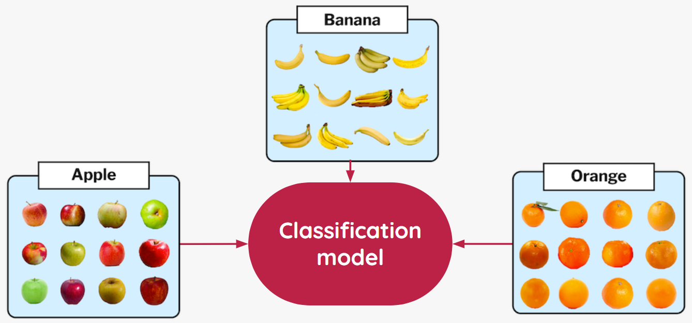
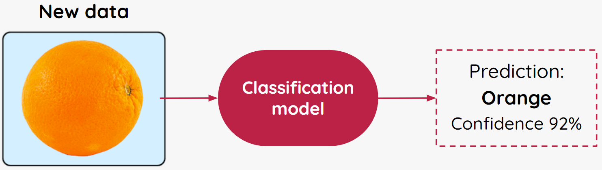

## Play with predictive AI

In this step, you will explore some predictive AI applications on the internet and investigate how they work. 

--- task ---

First, have a play with **Dictation.io** by [clicking this link](https://dictation.io/speech){:target="_blank"} (you’ll need to give your browser permission to use your microphone - if you don't have one, you can skip to the next task). 

Click the blue **Start** button to start the application. While you’re dictating things, think about these questions and write the answers in your **Blueprint**:

1. What is the application doing? What clues can you see on the screen?

2. How do you think the application works to output/ produce these predictions? Can you get it to make a wrong prediction?

--- /task ---

--- task ---

Once you’ve had enough of dictation, have a play with an AI-powered game called **Quick, Draw!** by [clicking this link](https://quickdraw.withgoogle.com/){:target="_blank"}. (You can use your mouse or trackpad to draw.)

While you’re drawing, think about these questions and write the answers in your **Blueprint**:

1. What is the application doing? What clues can you see on the screen?

2. How do you think the application works to predict what you are trying to draw?

--- /task ---

--- task ---

Watch the [video about Quick, Draw!](https://youtu.be/X8v1GWzZYJ4){:target="_blank"} to see the designers of the game explain what it does, and have a look through the [Quick, Draw! image data set gallery](https://quickdraw.withgoogle.com/data){:target="_blank"} to see what thousands of other people drew!

--- /task ---

It is important to remember that the model cannot think or make choices - it just processes the data in the images and uses that information to detect patterns.

A **classification model** assigns data to a **class** by applying **labels**. Classification models must be trained with example data that already has labels assigned by a human. Once the model is trained, new data can be fed into the model and it will produce a **prediction** of which class the data belongs to.  

When new data is processed by the model, it is grouped into a **class**. When the model is used to compare your image to the examples used to train it, the model measures how closely your image fits the pattern it has detected in each class, and this is what it outputs - the level of **confidence** that your **sample data** should be in this class. 

Because of this, **the more and wider examples of training data you can train the model with, the more confidence it will show that the new data fits a particular class**.

### Think about: Bias

While more training data is **usually** better, we have to be careful that when we train the model, we don't influence it into being unfair by the data selected. This unfair influence on the machine learning model is called **bias**, and it’s really important that we don’t get it wrong. The impacts of bias in artificial intelligence can have really big negative effects on society when systems make wrong or unfair decisions for people. If you train a model on data which includes a lot more trees than flowers, the model will be statistically more likely to classify things as trees than flowers - that's **bias**.

But that’s enough talking for now - let’s make your first ML model!
