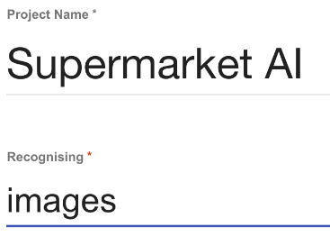
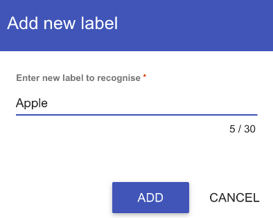
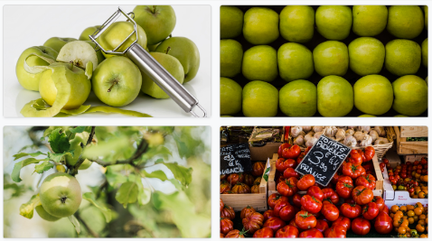

## Make a machine learning model

A supermarket has asked you to create a machine learning model that will recognise images of apples and tomatoes.

Your task is to set up and train a machine learning model that can do this by completing the following steps:

--- task ---

Open the website [Machine Learning for Kids](https://machinelearningforkids.co.uk/#!/login){:target="_blank"}.

--- /task ---

--- task ---

Select **Try it now**.

--- /task ---

--- task ---

Select **Add a new project**.

--- /task ---

--- task ---

Give the project a name and set it to recognise **images**.

--- /task ---

--- task ---

Select **CREATE**. Once created, click on the project title.

--- /task ---

--- task ---

Select **Train**.

--- /task ---

--- task ---

Select **Add new label** and create a label for the **apple** class.

**Repeat** this step to create a second label for the **tomato** class.

--- /task ---

--- task ---

Visit the following webpage to find the data set you can use to train your model: [Apples and Tomatoes](https://ai-activities.raspberrypi.org/project-files/){:target="_blank"} 

There are two sets of data on this page under the headings **Training Data** and **Test Data**.

--- /task ---

--- task ---

Look through the training data and **choose five images of apples and five images of tomatoes** from the data.

Drag and drop your chosen images into the relevant class (Apple or Tomato).

--- /task ---

--- task ---

Select **Back to project**.

--- /task ---

--- task ---

Next, select **Learn & Test**.

Your model is now ready to be trained. 

--- /task ---

--- task ---

Select **Train new machine learning model**.

--- /task ---

### Test your model

Now that you have trained your model, it is time to test it to see how successful it is.  
Some data has been kept aside to use as test data. You can find the images at the bottom of the [webpage hosting the data set](https://ai-activities.raspberrypi.org/project-files/){:target="_blank"}.

To see how successful your model is at classifying the test data, test your model with some of the images:

--- task ---

Drag and drop an image into the link box (next to the **Test with www** button):

--- collapse ---
---
title: Add a test image without drag and drop
---

Alternatively, you can:

+ Right-click on an image
+ Select **Copy image address**
+ Paste the image address into the link box

--- /collapse ---

--- /task ---

--- task ---

Click the **Test with www** button to test your model.

--- /task ---

--- task ---

Once you have tested a few of the images, answer the following questions in your **Blueprint**:

1. Describe the results of your testing. How accurate was the model? 
2. Why do you think the prediction is sometimes wrong?
3. How could you improve the accuracy of the model?

--- /task ---

### Bias and data

When training an ML model to recognise different things, like apples and tomatoes, lots of examples need to be processed. These examples are called **training data**.

If we use a training data set that contains mostly red tomatoes and green apples, this does not accurately represent the real world as there are also red apples and even green tomatoes. If the data used to train the model is not representative of what you're trying to model, then the prediction that your model makes won't be representative of the real world either.

This is called **bias**, which means that some outcomes or predictions are favoured over others. We can fix this by using a more diverse training data set. For example, we could use a data set that includes different types and colours of apples and tomatoes. By doing this, we can train the model to distinguish other features that characterise each type of fruit, rather than just relying on the colour.

By using more diverse and representative training data, we can help ensure that the model makes accurate and fair predictions when it encounters new examples. This makes the model more useful and reliable for different applications, from identifying objects in photos to aiding decision-making in healthcare or finance.

Let's start making a machine learning application!
