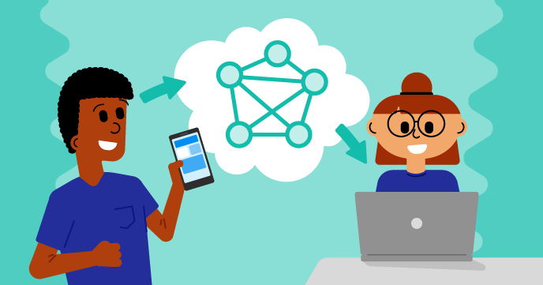

## What next?

Continue on your [Experience AI Music quest](https://projects.raspberrypi.org/en/raspberrypi/xaichallenge){:target="_blank"} and  move on to [Stage 2 - Create a classification app](https://projects.raspberrypi.org/en/projects/experimentai-project2){:target="_blank"}. In the next stage, you will create a machine learning model, then code an application that classifies songs in Scratch to help train your new machine learning model.

